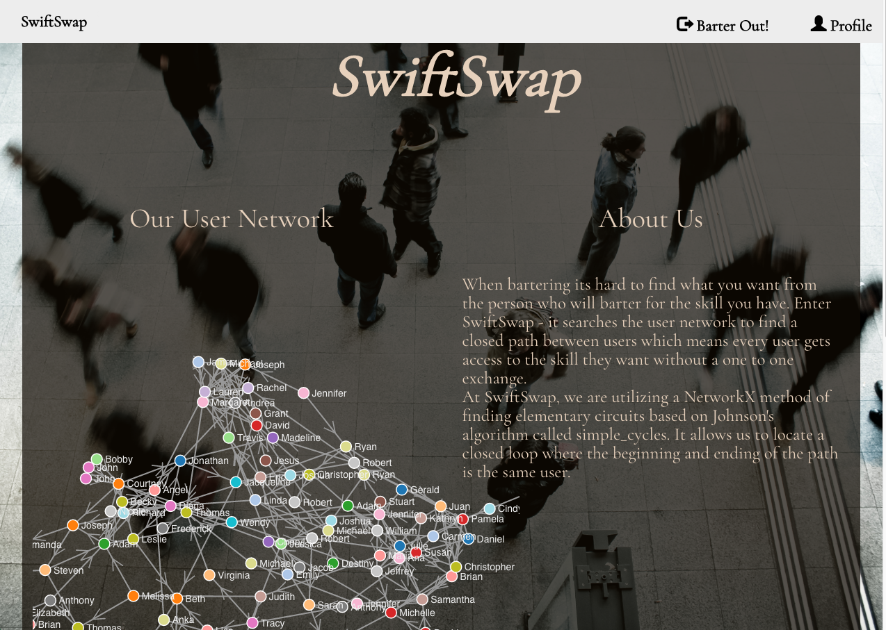
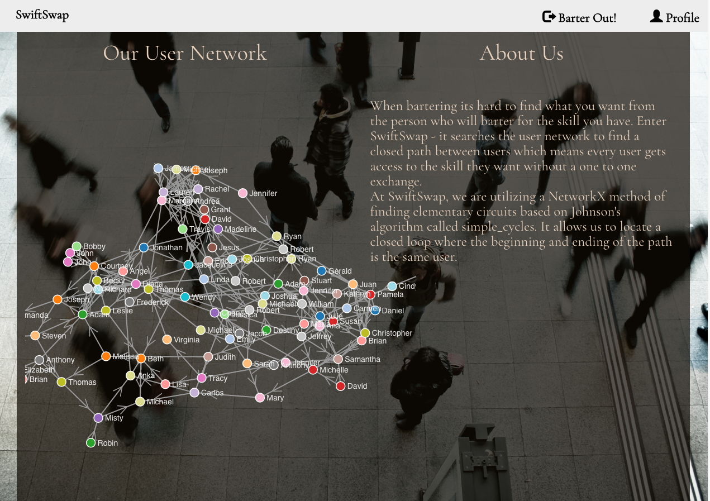
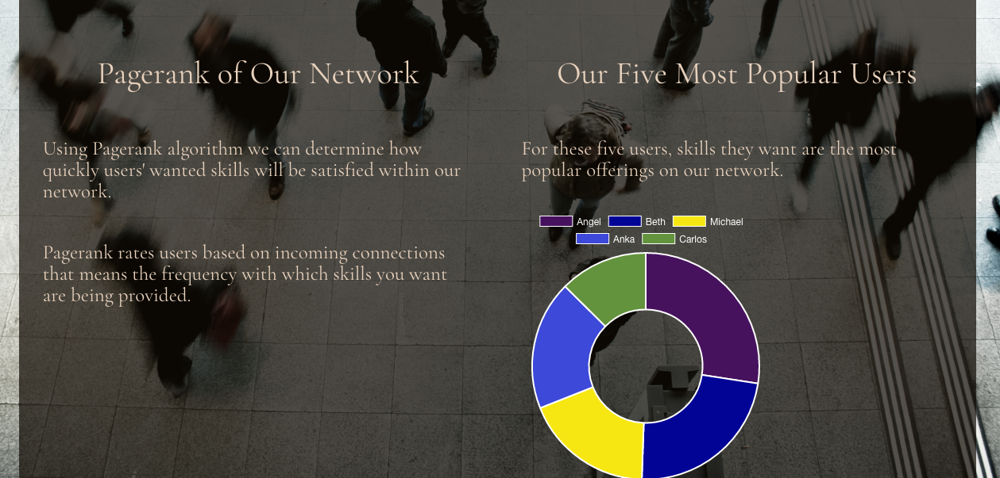
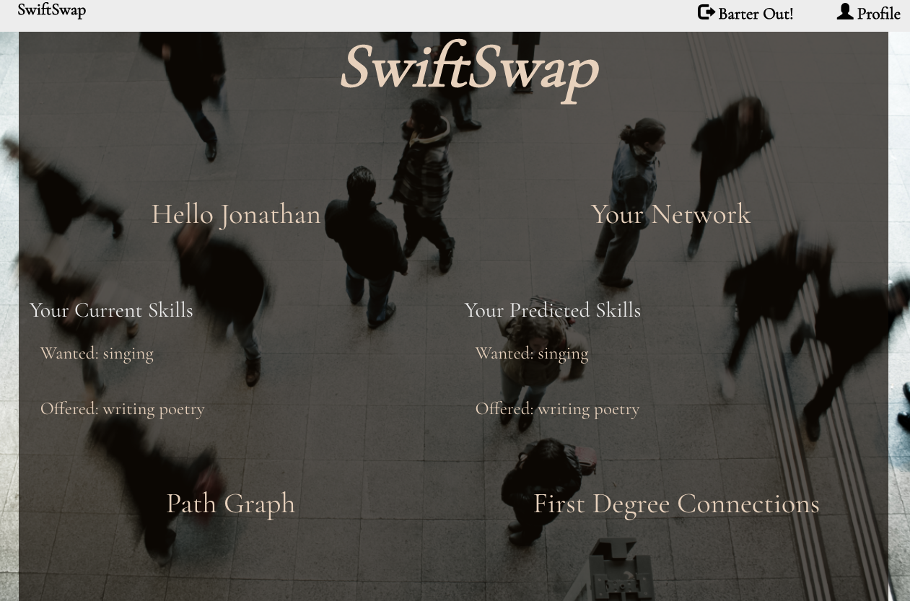
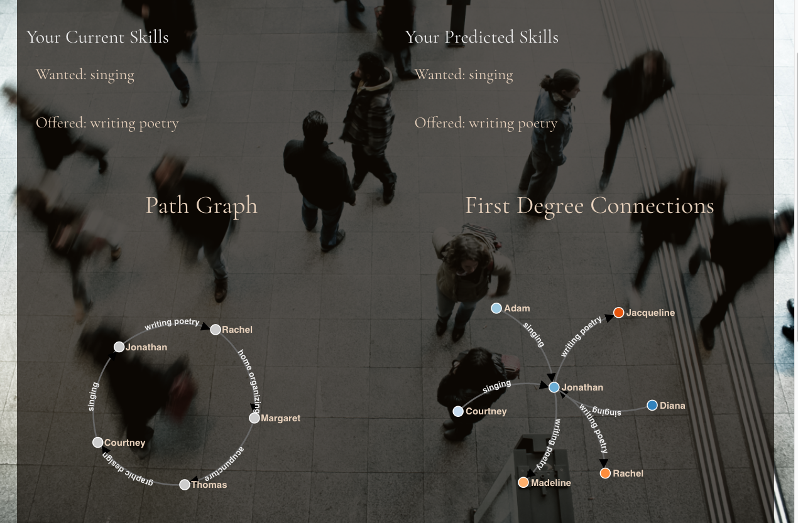
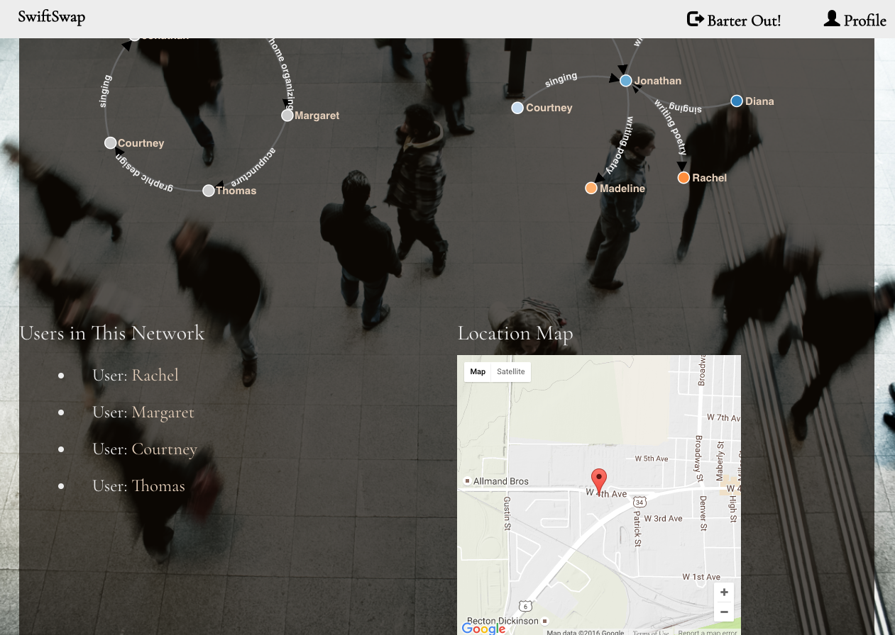

SwiftSwap

SwiftSwap overcomes the biggest challenge with bartering and that is that its hard to find what you want from the person who will barter for the skill you have.

SwiftSwap searches the user network to find a closed path⭕ between users which means every user gets access to the skill they want without a one to one exchange.

It utilizes a NetworkX method of finding elementary circuits based on Johnson's algorithm called simple_cycles. It locates a closed loop where the beginning and ending of the path is the same user⭕.

Users can sign up, enter their wanted and offered skills and find out if there is a closed path⭕ in the network that makes their bartering experience swift. Users also have access to users in their closed path⭕, can view their location and graphical representation of their path. 
The first degree connections graph shows users their network neighbors - direct connections to the user. 

## Table of Contents📖

* [Tech Stack](#tech-stack)
* [Features](#features)
* [Setup/Installation](#installation)
* [To-Do](#future)
* [License](#license)

## Tech Stack

__Frontend:__ D3, Jinja2,, AngularJS💕, Javascript, jQuery, Bootstrap  
__Backend:__ Python, NetworkX, Flask, PostgreSQL, SQLAlchemy, bcrypt, faker, pandas, NumPy, scikit-learn, geocoder  
__APIs:__ Google Maps API  

## Features

requirements.txt provided in /barter_network

